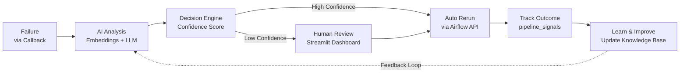
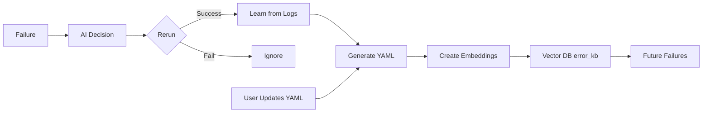
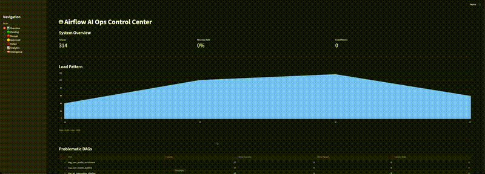

# <u>airflow-ai-ops</u>
A self-healing data pipeline platform built on Airflow that uses AI to classify failures, intelligently rerun tasks, and continuously learn from outcomes via vector embeddings and feedback loops.

## Overview

Airflow AI Ops is an intelligent platform that automatically detects, analyzes, and recovers from Airflow task failures. Instead of manually debugging logs and retrying tasks blindly, the system uses LLMs + vector search + feedback loops to make context-aware recovery decisions and continuously improve over time.

### Key Features

- 📡 Captures Airflow task failures in real-time via callbacks
- 🔍 Uses semantic search (pgvector) to find similar historical errors
- 🤖 Applies LLM reasoning + context to classify failures
- ⚡ Recommends actions: RERUN / NO_RERUN with confidence scoring
- 🧑‍💻 Supports human-in-the-loop approvals for edge cases
- 🔁 Automatically reruns tasks based on confidence + SLA rules
- 📚 Learns from successful recoveries and updates its knowledge base

## Tech Stack

| Layer | Technology | Description |
|-------|-----------|------------|
| Orchestration | [Apache Airflow](https://airflow.apache.org/) | Manages DAGs, callbacks, and recovery workflows |
| Storage | [PostgreSQL](https://www.postgresql.org/) | Central state store for pipeline signals |
| Semantic Search | [pgvector](https://github.com/pgvector/pgvector) | Enables similarity-based error retrieval |
| AI Reasoning | [Ollama](https://ollama.com/) | Runs LLMs locally for classification |
| Embeddings | [nomic-embed-text](https://ollama.com/library/nomic-embed-text) | Generates vector embeddings |
| Application | [Python](https://www.python.org/) | Implements AI logic and Airflow operators |
| UI | [Streamlit](https://streamlit.io/) | Review, approve, and monitor decisions |
| Knowledge Base | [YAML](https://yaml.org/) | Human-readable + auto-learned knowledge base |
| Integration | [Airflow REST API](https://airflow.apache.org/docs/apache-airflow/stable/stable-rest-api-ref.html) | Programmatic task reruns |
| Infrastructure | [Docker](https://www.docker.com/) | Containerized runtime |


## Architecture


### System Flow

**Failure → AI → Decision → Rerun → Learn → Improve**

- **Airflow Layer**: Captures failures via callbacks and logs to `pipeline_signals`
- **AI Intelligence**: Uses embeddings + pgvector to find similar errors, applies LLM reasoning
- **Decision Engine**: Routes to auto-rerun (high confidence) or human review (low confidence)
- **Human Review**: Streamlit dashboard for approvals with error details and logs
- **Recovery Layer**: Clears tasks and tracks rerun outcomes via Airflow API
- **Learning Loop**: Generates YAML knowledge base from successful recoveries



## 🔁 Learning & Knowledge Store

The system continuously improves using a hybrid approach:

- 📘 Human-curated knowledge → users can update YAML files  
- 🤖 Auto-learning → learns from successful reruns  

---



---

### 💡 Key Idea

The system combines **human knowledge + real-world outcomes**:

- Users can directly update YAML rules  
- The system automatically learns from successful reruns  
- Knowledge is converted into embeddings for future decisions  

---

### 🚀 Result

- Smarter AI decisions over time  
- Reduced manual intervention  
- Transparent and controllable learning system  

## 📊 Example Data for Tables

---

## 🧠 Table: airflow_feed.error_kb

| id | service | error_text | normalized_error | suggested_action | root_cause | source |
|----|--------|-----------|------------------|------------------|-----------|--------|
| 1 | spark | FetchFailedException: Failed to fetch shuffle blocks | fetchfailedexception failed to fetch shuffle blocks | RERUN | Shuffle fetch failed due to executor or network issue | human |
| 2 | dbt | Database Error: column not found | database error column not found | NO_RERUN | Incorrect column reference | human |
| 3 | s3 | 503 Slow Down | slow down | RERUN | S3 rate limiting | human |
| 4 | postgres | deadlock detected | deadlock detected | RERUN | Concurrent transaction conflict | auto |
| 5 | airflow | Task timed out | task timed out | RERUN | Execution timeout | auto |

> Note: `embedding` column is omitted here for readability (stores vector values).

---

## ⚙️ Table: airflow_feed.pipeline_signals

| id | signal_type | dag_id | task_id | error | ai_action | user_confirmation | rerun_status | confidence_score | run_status |
|----|------------|--------|---------|-------|-----------|-------------------|--------------|------------------|-----------|
| 1 | failure | spark_etl_dag | load_data | FetchFailedException | RERUN | approved | fixed on rerun | 92.5 | success |
| 2 | failure | dbt_model_dag | transform | column not found | NO_RERUN | pending | NULL | 45.0 | failed |
| 3 | failure | s3_ingest_dag | download | 503 Slow Down | RERUN | approved | failed | 78.0 | failed |
| 4 | failure | airflow_monitor | check_status | Task timed out | RERUN | cleared | processing | 85.0 | NULL |
| 5 | failure | postgres_sync | upsert_data | deadlock detected | RERUN | approved | fixed on rerun | 88.0 | success |

---

## 🧾 Example metadata (JSONB)

```json
{
  "try_number": 2,
  "execution_date": "2026-03-26T10:00:00",
  "log_url": "http://airflow/log"
}
```

---

## 🧠 Example ai_review (JSON stored as text)

```json
{
  "summary": "Transient network issue during shuffle",
  "reasoning": "Similar past errors resolved with retry",
  "confidence": 92
}
```

---

## 🔁 How they connect

```text
pipeline_signals (runtime failures)
        ↓
AI Decision + Rerun
        ↓
Successful rerun (fixed on rerun)
        ↓
Learn → YAML → Embeddings
        ↓
error_kb (knowledge store)
```


## ⚙️ Prerequisites

Before running this project, ensure you have the following installed and running on your machine.

---

### 🐳 Docker

Used to run Airflow, PostgreSQL, and supporting services.

- Install: https://docs.docker.com/get-docker/

Verify:

```bash
docker --version
docker compose version
```

---

### 🧠 Ollama (Local LLM Runtime)

Used for:

- failure reasoning (LLM)
- semantic embeddings (vector search)

- Install: https://ollama.com/

Start Ollama:

```bash
ollama serve
```

---

### 📦 Required Models

Pull the required models:

```bash
ollama pull llama3
ollama pull nomic-embed-text
```

Model usage:

- `llama3` → AI reasoning and decision making  
- `nomic-embed-text` → embeddings for similarity search  

---

### ✅ Verify Setup

```bash
ollama list
```

You should see:

```
llama3
nomic-embed-text
```

---

### 🌐 Network Configuration

If running Airflow in Docker and Ollama locally:

```
http://host.docker.internal:11434
```

---

### ⚠️ Notes

- Ensure Docker is running before starting  
- Ensure Ollama is running before triggering AI workflows  
- First-time model pulls may take a few minutes  

---

## 🚀 Quick Start

```bash
make up
cd frontent; streamlit run frontend_streamlit.py
```

---

## 🧪 Optional: Test Ollama

```bash
ollama run llama3
```

```bash
curl http://localhost:11434/api/embed -d '{
  "model": "nomic-embed-text",
  "input": "test embedding"
}'
```

## 🧑‍💻 Streamlit Dashboard (Control Center) (/frontend/frontend_streamlit)

The Streamlit dashboard acts as the **central control plane** for monitoring, decision-making, and recovery operations.

It provides real-time visibility into pipeline failures and enables both **AI-driven** and **human-assisted** resolution workflows.

## 🎥 Live Demo

<div align="center">
  
</div>

---

### 📊 Key Features

#### 🔍 Failure Monitoring
- Displays all pipeline failures in real time  
- Shows DAG, task, error message, and execution context  
- Tracks retry attempts and current status  

---

#### 🧠 AI Insights
- Displays AI-generated summaries of failures  
- Shows recommended action (`RERUN` / `NO_RERUN`)  
- Highlights **confidence score** with visual indicators  

---

#### ⚖️ Decision Interface
- Approve or reject AI decisions  
- Override AI when needed  
- Seamless transition between **automation and manual control**  

---

#### 🔁 Rerun Management
- Trigger reruns directly from the UI  
- Monitor rerun outcomes (success / failure)  
- Retry failed reruns or escalate to manual review  

---

#### 📈 System Overview
- Success vs failure rates  
- Peak vs low load hours  
- Top failing DAGs  
- Operational health indicators  

---

### 🎯 Design Philosophy

The dashboard is designed to:

- Reduce operational toil  
- Provide explainability for AI decisions  
- Enable fast incident response  
- Balance automation with human oversight  

---

### 🔄 Role in the System

```text
Streamlit = Human + AI Interface Layer

```
## ⭐️ Show your support

If you like this project, please leave a ⭐ on GitHub — it really helps!