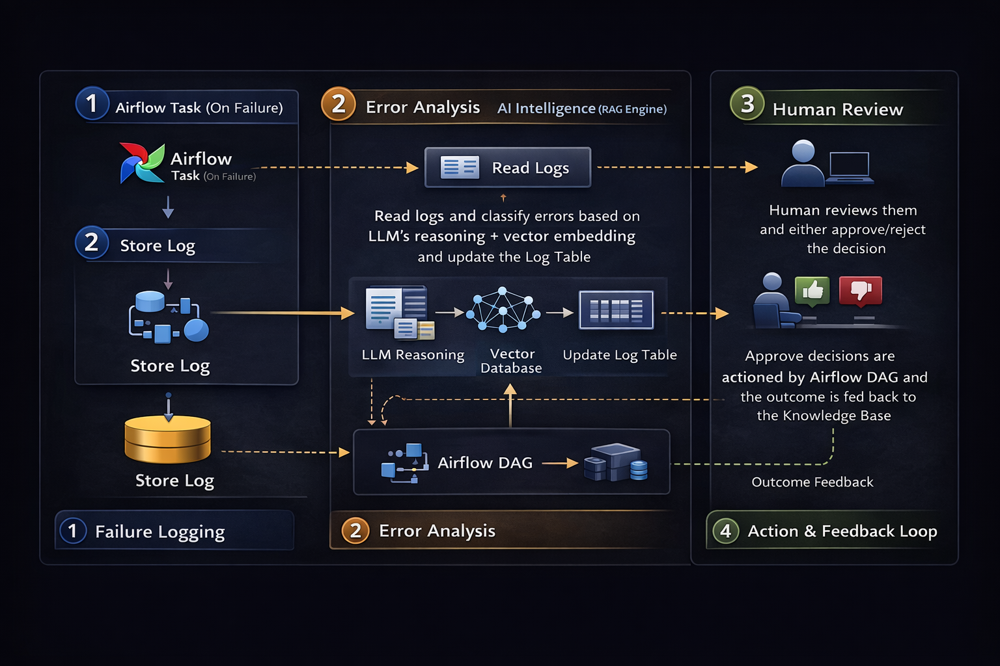
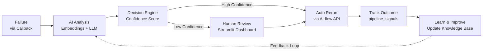

# <u>airflow-ai-ops</u>
A self-healing data pipeline platform built on Airflow that uses AI to classify failures, intelligently rerun tasks, and continuously learn from outcomes via vector embeddings and feedback loops.

## Overview

Airflow AI Ops is an intelligent platform that automatically detects, analyzes, and recovers from Airflow task failures. Instead of manually debugging logs and retrying tasks blindly, the system uses LLMs + vector search + feedback loops to make context-aware recovery decisions and continuously improve over time.

### Key Features

- 📡 Captures Airflow task failures in real-time via callbacks
- 🔍 Uses semantic search (pgvector) to find similar historical errors
- 🤖 Applies LLM reasoning + context to classify failures
- ⚡ Recommends actions: RERUN / NO_RERUN with confidence scoring
- 🧑‍💻 Supports human-in-the-loop approvals for edge cases
- 🔁 Automatically reruns tasks based on confidence + SLA rules
- 📚 Learns from successful recoveries and updates its knowledge base

## Tech Stack

| Layer | Technology | Description |
|-------|-----------|------------|
| Orchestration | [Apache Airflow](https://airflow.apache.org/) | Manages DAGs, callbacks, and recovery workflows |
| Storage | [PostgreSQL](https://www.postgresql.org/) | Central state store for pipeline signals |
| Semantic Search | [pgvector](https://github.com/pgvector/pgvector) | Enables similarity-based error retrieval |
| AI Reasoning | [Ollama](https://ollama.com/) | Runs LLMs locally for classification |
| Embeddings | [nomic-embed-text](https://ollama.com/library/nomic-embed-text) | Generates vector embeddings |
| Application | [Python](https://www.python.org/) | Implements AI logic and Airflow operators |
| UI | [Streamlit](https://streamlit.io/) | Review, approve, and monitor decisions |
| Knowledge Base | [YAML](https://yaml.org/) | Human-readable + auto-learned knowledge base |
| Integration | [Airflow REST API](https://airflow.apache.org/docs/apache-airflow/stable/stable-rest-api-ref.html) | Programmatic task reruns |
| Infrastructure | [Docker](https://www.docker.com/) | Containerized runtime |

## Architecture



### System Flow

**Failure → AI → Decision → Rerun → Learn → Improve**

- **Airflow Layer**: Captures failures via callbacks and logs to `pipeline_signals`
- **AI Intelligence**: Uses embeddings + pgvector to find similar errors, applies LLM reasoning
- **Decision Engine**: Routes to auto-rerun (high confidence) or human review (low confidence)
- **Human Review**: Streamlit dashboard for approvals with error details and logs
- **Recovery Layer**: Clears tasks and tracks rerun outcomes via Airflow API
- **Learning Loop**: Generates YAML knowledge base from successful recoveries



## ⚙️ Prerequisites

Before running this project, ensure you have the following installed and running on your machine.

---

### 🐳 Docker

Used to run Airflow, PostgreSQL, and supporting services.

- Install: https://docs.docker.com/get-docker/

Verify:

```bash
docker --version
docker compose version
```

---

### 🧠 Ollama (Local LLM Runtime)

Used for:

- failure reasoning (LLM)
- semantic embeddings (vector search)

- Install: https://ollama.com/

Start Ollama:

```bash
ollama serve
```

---

### 📦 Required Models

Pull the required models:

```bash
ollama pull llama3
ollama pull nomic-embed-text
```

Model usage:

- `llama3` → AI reasoning and decision making  
- `nomic-embed-text` → embeddings for similarity search  

---

### ✅ Verify Setup

```bash
ollama list
```

You should see:

```
llama3
nomic-embed-text
```

---

### 🌐 Network Configuration

If running Airflow in Docker and Ollama locally:

```
http://host.docker.internal:11434
```

---

### ⚠️ Notes

- Ensure Docker is running before starting  
- Ensure Ollama is running before triggering AI workflows  
- First-time model pulls may take a few minutes  

---

## 🚀 Quick Start

```bash
make up
make ui
```

---

## 🧪 Optional: Test Ollama

```bash
ollama run llama3
```

```bash
curl http://localhost:11434/api/embed -d '{
  "model": "nomic-embed-text",
  "input": "test embedding"
}'
```


## ⭐️ Show your support

If you like this project, please leave a ⭐ on GitHub — it really helps!